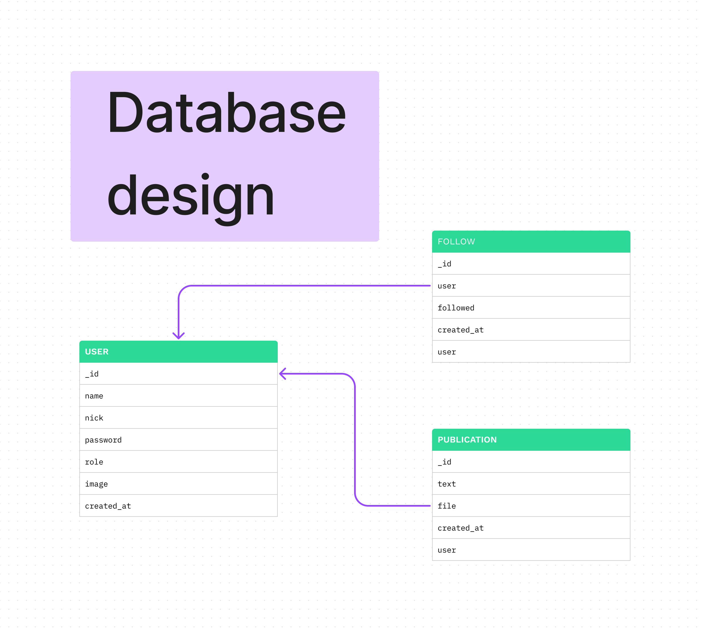

# Social Network API

## 1. Resumen del proyecto

Este proyecto consiste en la creación de una API REST para una red social utilizando Node.js, MongoDB y Express. La API proporciona diversas funcionalidades para el manejo de usuarios, publicaciones, comentarios, likes y seguidores. 

La API utiliza la autenticación de usuario mediante JWT y la encriptación de contraseñas mediante Bcrypt. Además, se utiliza el middleware Multer para la carga de imágenes y la validación de datos con Validator. La paginación se realiza con Mongoose Paginate y las pruebas unitarias con Jest. 

Con esta API REST, se puede implementar una red social personalizada y escalable con facilidad.

## 2. Database design

La imagen muestra el diseño de la base de datos utilizado para esta API REST. La base de datos está diseñada utilizando MongoDB y consta de varias colecciones, incluyendo usuarios, publicaciones y seguidores.

El diseño de la base de datos está pensado para permitir una fácil escalabilidad y un acceso rápido y eficiente a los datos.

